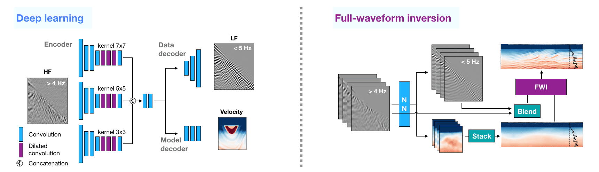

# Multi-task learning for low-frequency extrapolation and elastic model building from seismic data


by [Ovcharenko Oleg](https://ovcharenkoo.com/), [Vladimir Kazei](https://vkazei.com/), [Tariq Alkhalifah](https://sites.google.com/a/kaust.edu.sa/tariq/home) and [Daniel Peter](https://github.com/danielpeter). This repository contains the general workflow and synthetic data experiments reported in my [Ph.D. dissertation](https://repository.kaust.edu.sa/handle/10754/673716) and our [paper at IEEE Transactions on Geoscience and Remote Sensing](https://ieeexplore.ieee.org/document/9804738).

Note that examples below include **experiments on synthetic data only** due to the copyright associated with publishing the field data results.



## Abstract
Low-frequency signal content in seismic data as well as a realistic initial model are key ingredients for robust and efficient full-waveform inversions. However, acquiring low-frequency data is challenging in practice for active seismic surveys. Data-driven solutions show promise to extrapolate low-frequency data given a high-frequency counterpart. While being established for synthetic acoustic examples, the application of bandwidth extrapolation to field datasets remains non-trivial. Rather than aiming to reach superior accuracy in bandwidth extrapolation, we propose to jointly reconstruct low-frequency data and a smooth background subsurface model within a multi-task deep learning framework. We automatically balance data, model and trace-wise correlation loss terms in the objective functional and show that this approach improves the extrapolation capability of the network. We also design a pipeline for generating synthetic data suitable for field data applications. Finally, we apply the same trained network to synthetic and real marine streamer datasets and run an elastic full-waveform inversion from the extrapolated dataset.

## Repository structure
All notebooks are set for inference / view by default. Meaning that these will not run any heavy calculations unless reset otherwise. Instead, these will use the pre-trained weights and data to partially reproduce results from the paper. The `Need extra` column indicates that you would need to install third-party software to properly run these notebooks (installation scripts created when building the Docker container).

| Filename | Need extra | Description |
| -------- | ----- | ---- |
| ex0_create_training_dataset.ipynb | Yes | Generate training dataset of synthetic waveforms | 
| ex1_unet_l.ipynb | | Train UNet to predict low-frequency data | 
| ex2_multi_l.ipynb | | Train Multi-column network to predict low-frequency data |
| ex3_multi_lm.ipynb |  | Train Multi-column network to predict low-frequency data and local subsurface model|
| ex4_multi_lc.ipynb | | Train Multi-column network to predict low-frequency data using extra trace-wise correlation loss term | 
| ex5_multi_lcm.ipynb | | Train Multi-column network to predict low-frequency data and local subsurface model. Also use the trace-wise correlation loss to fit the data |
| ex6_fwi_marmousi_with_predicted.ipynb | Yes | Run / view full-waveform inversion from predicted low-frequency data and initial subsurface model| 
| ex7_fwi_marmousi_without_predicted.ipynb | Yes | Run / view full-waveform inversion from bandlimited data and poor initial model |
| ex8_make_pictures.ipynb | | Compare all trained networks and make key figures | 
| shared_data_loading.ipynb | | This notebook is called by ex1-5|
| pyapi_denise.py | | High-level interface for DENISE-Black-Edition software package for seismic waveform simulation and inversion |
| assets | | Folder with images for README| 
| pretrained_files | | Download and place pre-trained data here | 
| utils |  | Code components | 


## How to start
Follow instructions below to start a Docker container, download the data and install all required dependencies (DENISE, Madagascar). Note, that `scripts` folder will be created automatically.

Download the code
```
git clone https://github.com/ovcharenkoo/mtl_low.git
cd mtl_low/
bash run-docker.sh
```

Install third-party software and download the data (~14Gb)
```
cd /workspace/
bash install_denise.sh
bash install_madagascar.sh
bash download_data.sh
cd /workspace/project
```

Add Madagascar to path
```
source /workspace/project/madagascar/share/madagascar/etc/env.sh
```

Run the Jupyter Lab on the default port 8888
```
jupyter lab .
```

### Prerequsites and dependencies
* Python 3.8
* PyTorch 1.8
* CUDA 11.0
* NVIDIA Docker runtime

For the rest of Python dependencies check `requirements.txt`.

The following dependencies are installed by following the instructions above. Alternatively, to run FWI and data generation notebooks on your machine (examples 0, 6 and 7) you would need to download and compile [DENISE-Black-Edition](https://github.com/daniel-koehn/DENISE-Black-Edition) software for numerical wave propagation, followed by changing relevant paths in aforementioned notebooks. Moreover, for generation of the training dataset from scratch, you would need to install [Madagascar](https://github.com/ahay/src) software for seismic data processing.

### Downloads
Run `scripts/download_data.sh` or manually download and unzip files by running `tar -xvf arhive.tar.gz` and place the complete folders according to the table

| Link | Size | Destination | Description
| ---- | -----| ------------| ----------- |
| [data.tar.gz](https://www.dropbox.com/s/58zckalcm6wlp06/data.tar.gz?dl=1) | ~ 13 Gb | `./pretrained_files/data/*` | training and validation datasets
| [trained_nets.tar.gz](https://www.dropbox.com/s/a8wvncp86iiob0d/trained_nets.tar.gz?dl=1) | ~ 300 Mb| `./pretrained_files/trained_nets/*` | Pre-trained network weights
| [fwi_outputs.tar.gz](https://www.dropbox.com/s/jpnb18j62jqrs22/fwi_outputs.tar.gz?dl=1) | ~ 10 Mb | `./pretrained_files/fwi_outputs/*` | Inverted subsurface models etc.

## Acknowledgments
Our implementation is heavily influenced and contains code blocks from [Inpainting GMCNN](https://github.com/shepnerd/inpainting_gmcnn).

## Contact
Please raise an issue or let me know if something works wrong
oleg.ovcharenko@kaust.edu.sa
